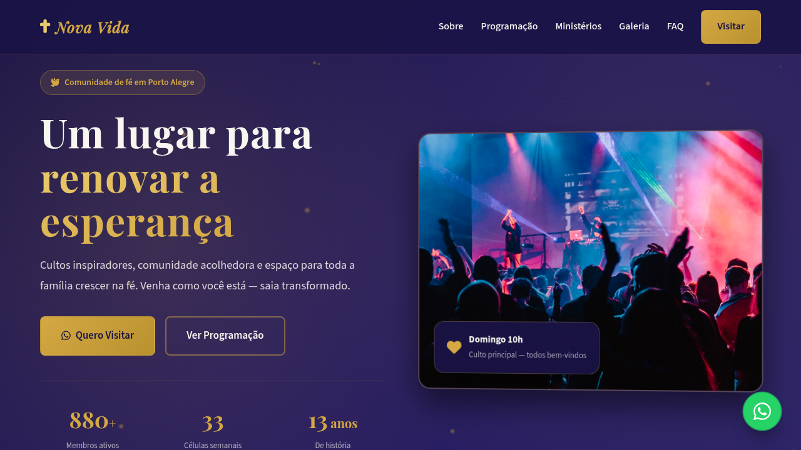
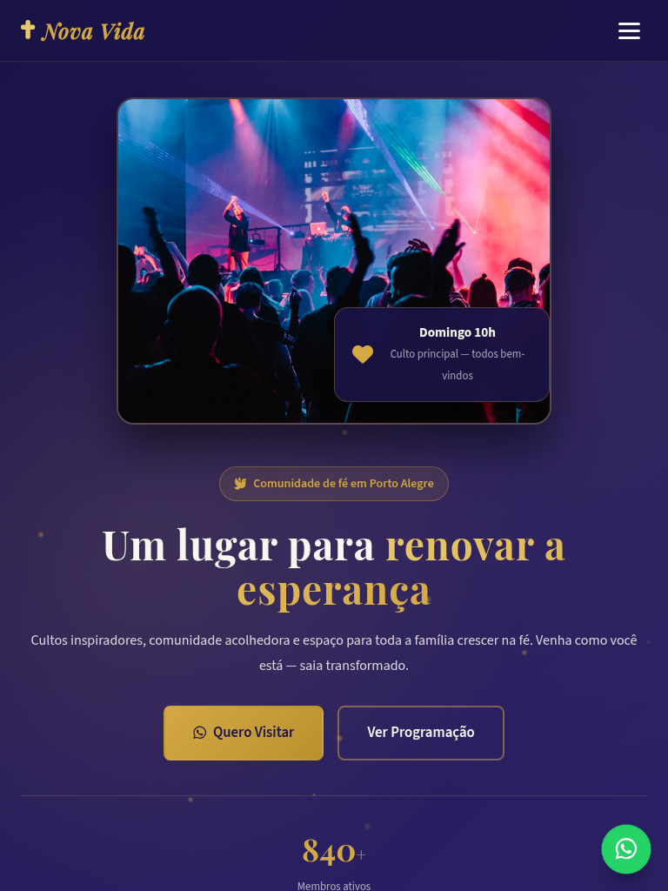
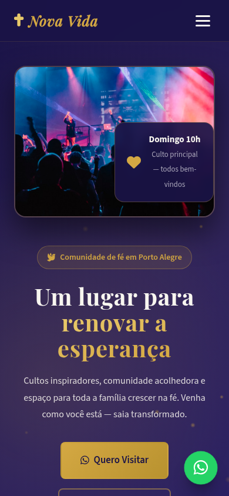

# Passo Fundo — Landing Page de Turismo

Landing page de alta conversão para turismo em **Passo Fundo** (Norte Gaúcho · Capital Nacional da Literatura), com atrações autênticas, eventos locais, galeria visual e agendamento estruturado via WhatsApp.

[](https://tofariasti.github.io/turismo-passo-fundo/)

## Demo

**Moldura (preview):** [https://tofariasti.github.io/turismo-passo-fundo/](https://tofariasti.github.io/turismo-passo-fundo/)

**Tela cheia:** [https://tofariasti.github.io/turismo-passo-fundo/site/](https://tofariasti.github.io/turismo-passo-fundo/site/)

## Screenshots

### Desktop (1280px)


### Tablet (768px)


### Mobile (390px)


## Funcionalidades

- Design responsivo mobile-first com identidade visual regional
- Integração WhatsApp com formulário para agendar visita (nome, data, pessoas, roteiro)
- Animações AOS, partículas no hero, contadores e hover nos cards
- Seções: Hero, Como funciona, Atrações, Eventos, Galeria, FAQ e Contato
- Botão flutuante WhatsApp com pulse
- Acessibilidade: skip link, ARIA, contraste, foco visível, alt text
- Respeita `prefers-reduced-motion`
- Moldura iframe com preview desktop/tablet/mobile

## Pontos turísticos destacados

- **Parque da Gare** — Maior parque da cidade com monumento ao Homem Voador, lago e eventos culturais.
- **Catedral Metropolitana** — Imponente catedral com torres inspiradas em Notre-Dame — marco do centro.
- **Complexo Roselândia** — Parque de rodeios, CTGs, kartódromo e tradição gaúcha em 200 hectares.
- **Praça do Teixeirinha** — Monumento ao cantor Victor Mateus Teixeira — ícone do tradicionalismo gaúcho.
- **Chafariz da Mãe Preta** — Fonte histórica com lenda local — quem bebe da água sempre volta a Passo Fundo.
- **Avenida Brasil** — Via arborizada com Tuneis da Literatura, Letra Gigante e ciclovia central.

## Eventos

- **Jornada Nacional de Literatura** (Bienal) — Maior evento literário da América Latina — autores nacionais e internacionais.
- **Rodeio Internacional** (Fev) — Provas campeiras e artísticas a cada 2 anos no Parque de Rodeios da Roselândia.
- **Festival Internacional de Folclore** (Ago) — Grupos de diversos países em espetáculos de integração cultural.
- **Feiras e eventos culturais** (Ano todo) — Programação no Parque da Gare, teatros e espaços culturais da cidade.

## Tecnologias

- HTML5 semântico · CSS3 · JavaScript vanilla
- AOS 2.3.4 · Font Awesome 6.4 · Google Fonts (Rajdhani + Inter)

## Screenshots (geração)

```bash
python3 -m http.server 8765
npm install
npm run screenshots
```

## Repositório

https://github.com/tofariasti/turismo-passo-fundo

## Autor

**Tiago O. de Farias** — [Farias Digital](https://fariasdigital.com.br/)

---

<p align="center">
  <a href="https://tofariasti.github.io/turismo-passo-fundo/">🌐 Demo Online</a> ·
  <a href="https://fariasdigital.com.br/">🏢 Site Comercial</a>
</p>
